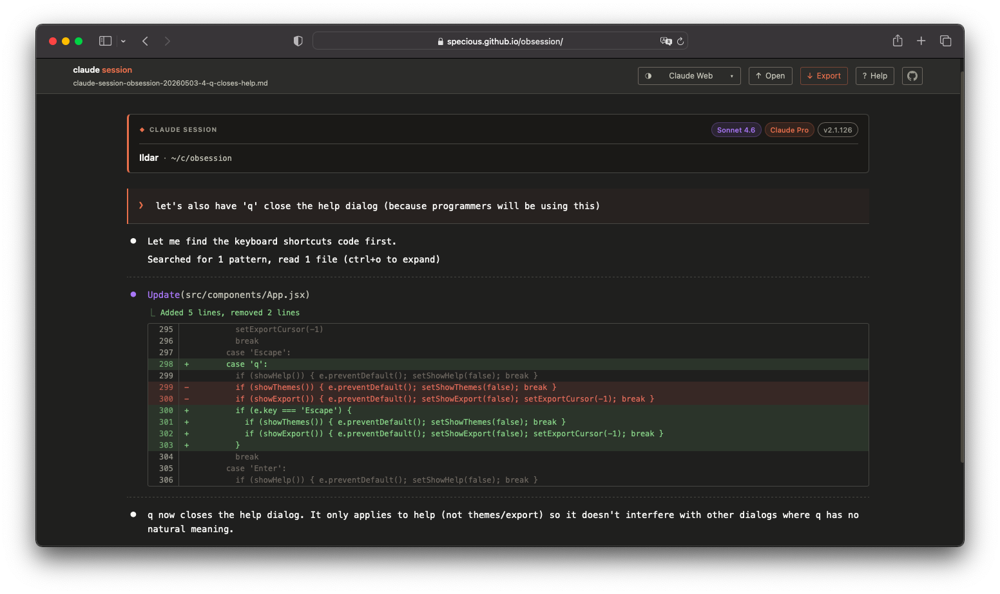

# obsession (claude session viewer)

Every Claude Code user hits the same wall: you want to share a session. So you run `/export`. What you get is a raw `.md` dump — text mangled with code lines broken up, tool call JSON blobs, escaped characters, interleaved metadata. Completely unreadable to anyone who wasn't there.

**obsession** fixes that.

Give it a try — [**open in browser**](https://specious.github.io/obsession/) or [**download**](https://github.com/specious/obsession/releases/latest) for offline use. Browse the [**examples gallery**](https://obsession.edgeone.app/) to see what rendered sessions look like.



## What it does

Drop in your `/export` file and your session renders as a clean, readable conversation — diffs syntax-highlighted, tool calls clearly labeled, thinking-time indicators shown, 17 themes to choose from. No upload, no account. Runs entirely in your browser.

But the real power is **sharing**.

Export your session as a **self-contained HTML file** — a copy of this app with your session baked in. Whoever opens it gets the full interactive viewer, can switch themes, and can export it again. Their export is another full-featured copy. The person who receives *that* can re-export too. The chain never degrades, and no link back to this site is ever required.

Save one to your local system: it's a permanent offline viewer — no internet connection required, works forever.

## Getting started

In any Claude Code session, run:

```
/export
```

That writes a `.md` file to your working directory. Drag it into obsession or click to pick it.

**Want a local copy?** Download the latest release from the [releases page](https://github.com/specious/obsession/releases/latest) — it's a single self-contained HTML file. Save it anywhere and open it in your browser. No installation, no internet connection required.

## Features

**Clean rendering** — diffs inline next to the tool calls that produced them, thinking-time indicators, file references, fenced code blocks, all rendered correctly.

**17 themes** — Claude Dark · Claude Light · Claude Web · Dracula · Nord · Gruvbox Dark · Catppuccin Mocha · Solarized Dark · GitHub Dark · Jungle · Cyberpunk · Mars · Tokyo Night · Atelier Sulphurpool · Ayu Dark · Berries · Pacman

**Modern navigation** — browser back/forward buttons work as you move between sessions. Drag and drop a file from anywhere on the home screen or while viewing a session.

**Keyboard shortcuts** — press `?` to see them all. Quick reference:

| Key | Action |
|---|---|
| `?` | Keyboard shortcuts |
| `h` | Go home |
| `o` | Open file |
| `e` | Export menu |
| `t` | Theme picker |
| `[` / `]` | Previous / next theme |
| `Esc` | Close menus |

**Three export formats:**

Sizes are base overhead + your session content on top.

| Format | Base size | What you get |
|---|---|---|
| **Full-featured** | ~85 KB + content | A copy of this app with the session baked in — every recipient can re-export it |
| **Dynamic HTML** | ~20 KB + content | Rendered session with all 17 themes switchable |
| **Static HTML** | ~13 KB + content | Current theme only, zero JavaScript |

## Run locally

You need [Bun](https://bun.sh) (or npm, pnpm, etc.)

```sh
git clone https://github.com/specious/obsession
cd obsession
bun install
bun dev
```

Open [http://localhost:5173](http://localhost:5173).

> **Note:** Full-featured export is disabled in the dev server. The Vite dev server serves un-bundled modules — there's no single JS file to inline. To test full-featured export, use the production build: `bun run build && bun run preview` (served at http://localhost:4173).

## Build

```sh
bun run build
```

Output goes to `dist/` — a static site you can drop on any web host, S3 bucket, or GitHub Pages. Only `index.html` and the favicon need to be hosted; the other files in `dist/` are only used by `bun run preview`.

## Deploy to GitHub Pages

The included workflow (`.github/workflows/deploy.yml`) handles deployment. To enable it:

1. Go to **Settings → Pages** in your fork
2. Set **Source** to **GitHub Actions**

Then trigger a deployment manually: **Actions → Deploy to GitHub Pages → Run workflow**.

To deploy automatically on every push to `main` instead, add a `push` trigger to the workflow:

```yaml
on:
  push:
    branches: [main]
  workflow_dispatch:
```

## Parsing and rendering

The `/export` format is a lossy transformation — escaped characters, broken code lines, stripped formatting. obsession works hard to reconstruct a clean result.

But this is genuinely non-trivial. While some problems in the format are fully recoverable; others are structural limits of the way it works. The goal is to keep improving the parser to the degree that is possible.

There could also be accidental unintended discrepancies between the different export types with and without the "compact" setting.

**If something renders poorly or incorrectly, please share an example.** The best way is to [open an issue](https://github.com/specious/obsession/issues) and attach the `.md` export file (or paste the relevant excerpt). Include the app version — it's shown at the bottom of the keyboard shortcuts panel (`?`) (the static HTML export has no 'help' so the version is in the footer). Search first — if your case is already being tracked, add a comment and share your case so we know the scope of the problem. A concrete example is worth ten bug reports, and it's what actually moves the needle.

## Tech

[Solid.js](https://solidjs.com) · [Vite](https://vite.dev) (build/dev only) · no external dependencies

## License

ISC

---

[](https://buymeacoffee.com/codemutation)
